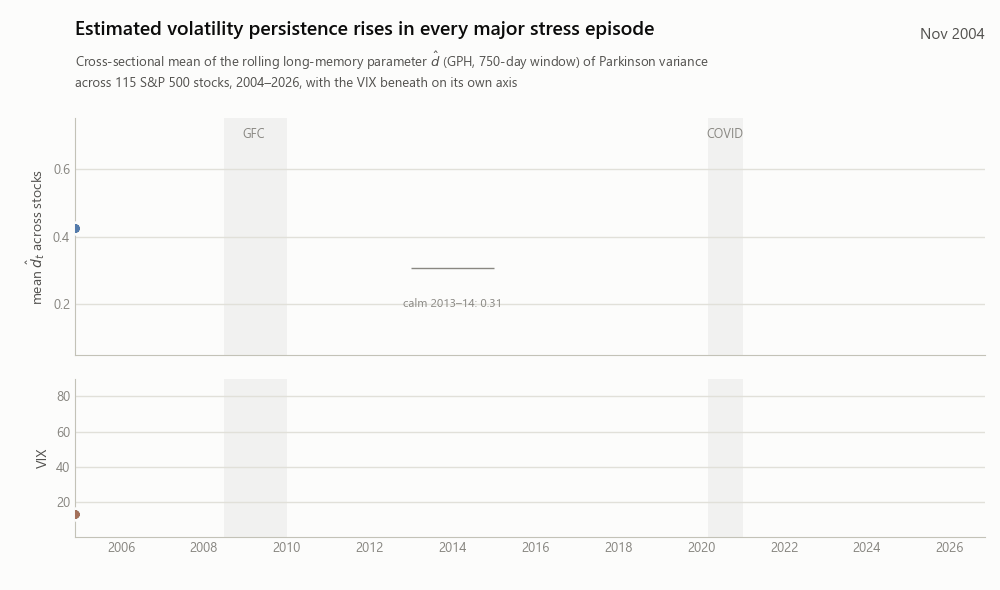

# Volatility Persistence as a Financial State Variable

**Memory, roughness, and forecasting across market regimes.** Code, data pipeline, and manuscript for Deep, Appiah & Rachev (2026), Texas Tech University.

[](https://www.python.org/downloads/)
[](LICENSE)
[-6f42c1.svg)](paper_jrfm/Memory_Roughness_edited.pdf)
[](CITATION.cff)

<p align="center">
  
</p>
<p align="center"><sub>The rolling long-memory parameter, averaged across 115 stocks, sits near 0.31 in calm years and jumps to 0.50 in the global financial crisis and 0.57 in COVID. It co-moves with the VIX (correlation +0.50) but is not the same thing. Generated by <code>modules/_hero_animation.py</code> from the repo's own outputs.</sub></p>

## The question

Anyone forecasting equity volatility already has two good tools. The VIX says how stressed the market is *right now*. A HAR regression says how volatile each stock has been over the past day, week and month. Neither says how *long* a volatility shock tends to linger. Long-memory econometrics has a parameter for exactly that, the fractional differencing order $d$, and it has been estimated on volatility series since the 1990s, almost always as a fixed property of one series.

We asked a narrower and more practical question. If you estimate $d$ on a rolling window for every stock in a large panel, average it across the market and across sectors, and hand the result to a forecaster that already has HAR and the VIX, does it help? At which horizons, in which regimes, and how much of the apparent gain is really the VIX's? The answer turned out to be more conditional than we first expected, and the repository is organised around making that honest comparison reproducible.

**What this repository does not do.** It does not identify a causal mechanism behind persistence, does not estimate how long any particular stress episode will last, and does not reconstruct point-in-time S&P 500 membership (the panel is survivorship-prone by construction). No intraday data enters the analysis. The Bloomberg inputs are not redistributed.

## What we found

Panel: 115 S&P 500 constituents, 6,136 trading days (29 Nov 2001 to 21 Apr 2026), daily OHLCV from Bloomberg. Volatility proxy: Parkinson range-based variance. Forecast target: log mean future variance over $h \in \{1, 5, 22\}$ days.

**Persistence is a market state, not a stock trait.**

| | Value |
|---|---|
| Long memory of Parkinson RV, GPH / local Whittle (cross-sectional mean) | $\hat d = 0.451$ / $0.440$ (99% / 100% significant) |
| Roughness of $\log\mathrm{RV}^{PK}$ (Hurst) | $H = 0.063$, all 115 stocks $H < \tfrac12$ |
| Cross-sectional mean $\bar d_t$: calm 2013–14 / GFC / COVID | 0.31 / 0.50 (+62%) / 0.57 (+86%) |
| Correlation $\rho(\bar d_t, \mathrm{VIX})$ | +0.50 |

**Own-stock persistence adds nothing to HAR, and the shared state does not beat HAR-X.** Point-in-time pooled out-of-sample MSE improvement over HAR (Model $A$), with the panel-aware HLN-corrected Diebold–Mariano statistic against HAR:

| Model | $h=1$ | $h=5$ | $h=22$ |
|---|---|---|---|
| $A_1$ = HAR-X (HAR + VIX, MOVE) | +5.10% (t = 5.34) | +7.72% (t = 5.31) | +2.82% (t = 1.49) |
| $A_2$ = HAR + own-stock $\hat d$ block | −0.54% | −0.03% | −1.89% |
| $C$ = full persistence state + HAR-X | **+4.55%** (t = 3.15) | **+8.24%** (t = 3.87) | −0.62% (t = −0.21) |
| $C$ minus HAR-X, in percentage points | −0.55 | +0.52 | −3.53 |

Tested directly against HAR-X, Model $C$ is never significantly better (HLN-DM t = −0.74, +0.48, −2.43). Clark–West, the appropriate test for nested models, rejects the null that the persistence regressors have zero population coefficients at every horizon, but that information does not survive per-stock estimation: three pre-registered HAR-X-plus-one-block specifications and a variant in which the persistence state modulates the HAR weights all leave MSE within 0.6% of HAR-X, mostly below it. Regime differences (high-VIX, COVID) are not significant. Full test tables: `results/tables/table11_harx_tests.tex`, ledger in [`docs/EXPERIMENTS.md`](docs/EXPERIMENTS.md).

**The economics are suggestive, not significant.** Moreira–Muir volatility-managed portfolios built on Model $C$ forecasts reach a COVID Sharpe ratio of 1.36 versus 1.06 for HAR-X management and 0.65 unmanaged (certainty-equivalent return +12.3% vs +8.6% vs −3.0%). Over the full sample the three Sharpe ratios are 0.73, 0.72 and 0.73. Ledoit–Wolf tests of the Sharpe differences: COVID p = 0.13 (bootstrap 0.36, 43 weeks); full sample p = 0.62.

**Flexibility does not help here.** Lasso, ridge and elastic net on the same 18 predictors roughly match the linear model at short horizons; random forests and gradient boosting are worse at every horizon.

## The paper

> **Volatility Persistence as a Financial State Variable: Memory, Roughness, and Forecasting Across Market Regimes**
> Akash Deep, Nicholas Appiah, Svetlozar T. Rachev
> Submitted to the *Journal of Risk and Financial Management*, September 2026.

The submission bundle (MDPI class, tables, figures, bibliography, compiled PDF) is in [`paper_jrfm/`](paper_jrfm/). Earlier drafts from April and May 2026, under the working title *Memory, Roughness, and Information Persistence in Financial Markets*, are kept for the record in [`paper_overleaf/`](paper_overleaf/), [`paper_overleaf_v2/`](paper_overleaf_v2/) and [`paper/`](paper/). The research diary, including what changed between drafts and why, is [`PROJECT_LOG.md`](PROJECT_LOG.md).

## The forecasting ladder

Models are identified by their predictor set; estimator-only differences are factored into Model $D$. Models $A_1$ to $A_5$ are parallel augmentations of $A$, not a sequence.

| Model | Predictors | $n$ |
|---|---|---|
| $A$ | HAR core: $\log\mathrm{RV}^{(d,w,m)}$, $r_{t-1}$, $\lvert r_{t-1}\rvert$ | 5 |
| $A_1$ (HAR-X) | $A$ + VIX, MOVE | 7 |
| $A_2$ | $A$ + own-stock block: $\hat d, \Delta\hat d, \mathrm{Vol}(\hat d), \mathrm{Trend}(\hat d), H, \Delta H$ | 11 |
| $A_3$ | $A$ + cross-sectional mean and dispersion of $\hat d$ | 7 |
| $A_4$ | $A$ + sector-mean $\hat d$ | 6 |
| $A_5$ | $A$ + $\hat d$, VIX, MOVE, $\hat d \times$ VIX, $\hat d \times$ MOVE | 10 |
| $C$ | Union of the $A_1$–$A_5$ blocks | 18 |
| $D$ | Same 18 predictors, estimated by Lasso / Ridge / Elastic Net / Random Forest / Gradient Boosting | 18 |

Evaluation is strictly walk-forward: the first 40% of weekly sample dates (through mid-2013) train the initial models, linear models are refit by expanding-window OLS at every step, and the ML estimators every twenty steps.

## Reproducing the analysis

The Bloomberg-sourced inputs under `bloomberg_pull/` are gitignored. With those in place:

```bash
pip install -r requirements.txt

# Data layer
python preprocess_bloomberg.py
python preprocess_supporting.py
python -m modules.io_v2                        # builds bloomberg_pull/processed/clean_panel/

# Estimation and features
python -m modules.module1_data_description     # Tables 1-2, Figure 1
python -m modules.module1b_preliminary_diagnostics
python -m modules.module2_lrd_estimation       # GPH, local Whittle, Hurst; Table 3, Figure 2 (~5 min)
python -m modules.module3_feature_engineering  # persistence feature panels, Table 4

# Forecasting
python -m modules.module4_benchmarks           # linear ladder A, A1..A5, C
python -m modules.module4b_garch               # GARCH(1,1) benchmark
python -m modules.module5_ml_models            # D_lasso, D_ridge, D_en, D_rf, D_gbm (slow)

# Evaluation and figures
python -m modules.module6_forecast_eval        # Tables 5-8, HLN-corrected DM
python -m modules.module9_robustness           # Table 9
python -m modules.module10_plots               # Figures 4-8
python -m modules.module11_economic            # Table 10, Figure 9 (vol-managed portfolios)
python -m modules._hero_animation              # README animation
```

Tables land in `results/tables/`, figures in `results/figures/`, intermediate panels in `results/intermediate/`. The paper bundles are hand-synced from those outputs. Forecast panels (`results/intermediate/forecasts/`) are `(T_eval × N)` CSVs, one pair of `yhat`/`y` files per model and horizon.

## Repository map

```
LRD-ML/
├── README.md, CITATION.cff, LICENSE
├── PROJECT_LOG.md              research diary, session by session
├── WORK_PLAN.md, REVISION_PLAN.tex, PHASE4_RESULTS.md, SESSION_REPORT.md
├── requirements.txt
│
├── modules/
│   ├── io_v2.py                             single source of truth for the panel
│   ├── forecast_io.py                       predictor sets (MODEL_FEATURES) and target assembly
│   ├── module1_data_description.py          Tables 1-2, Figure 1
│   ├── module1b_preliminary_diagnostics.py  FIGARCH table, diagnostics figure
│   ├── module2_lrd_estimation.py            GPH, local Whittle, Hurst (Table 3, Figure 2)
│   ├── module3_feature_engineering.py       persistence feature vector (Table 4)
│   ├── module4_benchmarks.py                linear ladder forecasts
│   ├── module4b_garch.py                    GARCH(1,1) benchmark
│   ├── module5_ml_models.py                 shrinkage and tree estimators
│   ├── module6_forecast_eval.py             HLN-corrected DM, Tables 5-8
│   ├── module9_robustness.py                Table 9
│   ├── module10_plots.py                    Figures 4-8
│   ├── module11_economic.py                 vol-managed portfolios (Table 10, Figure 9)
│   └── _hero_animation.py, _regen_*.py      README visual and quick regeneration helpers
│
├── preprocess_bloomberg.py, preprocess_supporting.py
├── bloomberg_pull/                          raw and processed Bloomberg data (gitignored)
│
├── paper_jrfm/                              current submission (MDPI class, PDF, tables, figures)
├── paper_overleaf/, paper_overleaf_v2/, paper/   earlier drafts, kept for the record
├── docs/assets/                             README animation and still
└── results/
    ├── tables/                              Tables 1-10 + FIGARCH
    ├── figures/                             Figures 1-9
    └── intermediate/                        forecasts/, features/, rolling estimates (gitignored CSVs)
```

## Methodology notes

**Persistence estimators.** Geweke–Porter-Hudak log-periodogram regression and Robinson local Whittle, bandwidth $m = \lfloor T^{0.65} \rfloor$, on a 750-day rolling window with a five-day stride, applied to the Parkinson variance series. Hurst exponents on $\log\mathrm{RV}^{PK}$ from the scaling of the $q=2$ moment of increments over lags $\{1,2,3,5,8,13,21\}$.

**Inference.** Diebold–Mariano with the Harvey–Leybourne–Newbold finite-sample correction, computed on the cross-sectional mean loss differential per date with a Newey–West HAC variance (bandwidth $\lceil h/5 \rceil - 1$ for multi-step overlap) and a Student-$t(T-1)$ reference. The naive pooled-cell DM statistic is about six times larger (+23.97 vs +3.87 for Model $C$ at $h=5$) because it ignores within-date cross-sectional dependence.

**Economic evaluation.** Moreira–Muir (2017) volatility-managed portfolios with weights $c_{m,i}/\hat\sigma^2_{m,i,t}$, per-stock variance normalisation, and weekly rebalancing aligned to the forecast stride. Reported without transaction costs.

**Robustness.** The $h=5$ headline survives swapping GPH for local Whittle, 500- and 1000-day windows, a squared-returns target, and liquidity halves (+4% to +9%, HLN-DM $t > 3$). A returns-based GARCH(1,1) is far worse under MSE (−93.5%) and modestly worse under Patton's proxy-robust QLIKE (HLN-DM $t = -2.80$).

**Correction (13 Sept 2026).** Earlier versions of this code divided the GPH slope by two, which is wrong for the regressor $\log[4\sin^2(\lambda_j/2)]$, so every GPH estimate reported before this date was half its true value (0.226 instead of 0.451 for the panel mean). The fix is in `module2_lrd_estimation.py`. Forecasting results are unaffected because every affected feature scales by exactly two and the estimators are scale-invariant; this was verified by re-running the linear ladder (largest change in any forecast: $10^{-10}$). Details in `PROJECT_LOG.md`.

**Correction (14 Sept 2026).** The expanding training window included rows whose target window extended past the forecast origin. With a five-day stride this affected only the monthly horizon (the last four training rows carried up to 17 days of future variance) and it produced the monthly-horizon gains reported in drafts before this date (Model $C$ +5.5% over HAR at $h=22$; point-in-time it is −0.6%). Daily and weekly results were unaffected. The embargo is in `forecast_io.n_train_rows` and is applied in modules 4, 5 and 9; `tests/test_embargo.py` checks it. The ledger entries run-01 to run-04 in [`docs/EXPERIMENTS.md`](docs/EXPERIMENTS.md) record the before-and-after numbers and the pre-registered follow-up tests.

## Citing

Please cite the paper (preferred) and, if you use the code, the repository. GitHub's "Cite this repository" button reads [`CITATION.cff`](CITATION.cff).

```bibtex
@article{deep2026persistence,
  title   = {Volatility Persistence as a Financial State Variable:
             Memory, Roughness, and Forecasting Across Market Regimes},
  author  = {Deep, Akash and Appiah, Nicholas and Rachev, Svetlozar T.},
  journal = {Journal of Risk and Financial Management},
  year    = {2026},
  note    = {Submitted. Code: \url{https://github.com/akashdeepo/LRD-ML}}
}
```

## Data

- Stock-level OHLCV and market-level series (VIX, MOVE, Treasury yields, CDX, sector ETFs) from the Bloomberg Terminal, accessed 21 April 2026. Raw and processed panels live under `bloomberg_pull/` and are not redistributed; the panel can be rebuilt from a Bloomberg pull with the preprocessing scripts above.
- Daily history starts 29 November 2001, the earliest date with full-panel coverage; a 70% coverage filter reduces 125 tickers to 115.
- An intraday slice (October 2025 to April 2026) exists in the private data folder but is not used in the paper.

## License, acknowledgements, contact

MIT License, see [LICENSE](LICENSE). Advisor and co-author: Prof. Svetlozar T. Rachev, Department of Mathematics and Statistics, Texas Tech University.

- Akash Deep, akash.deep@ttu.edu
- Nicholas Appiah, niappiah@ttu.edu
- Svetlozar T. Rachev, Texas Tech University

*Keywords: long memory, rough volatility, HAR, HAR-X, realized volatility, Parkinson estimator, GPH, local Whittle, Hurst exponent, Diebold–Mariano, volatility-managed portfolios, S&P 500, Python.*
